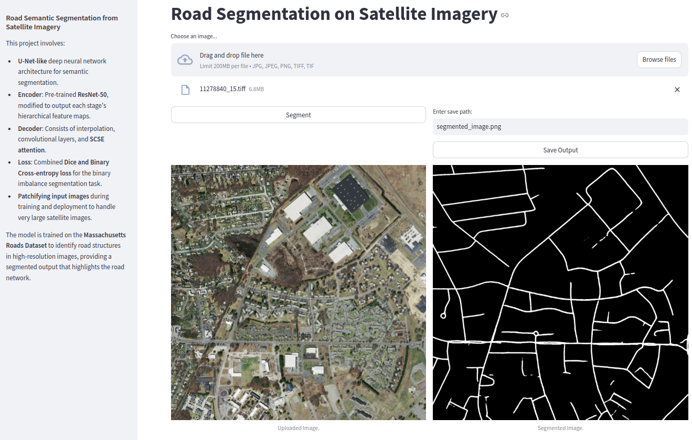

# Satellite Imagery Road Network Segmentation

<p align="center">
  
</p>

This project involves semantic segmentation of road networks in high-resolution satellite images using a U-Net-like deep neural network architecture. Key highlights of the project are as follows:

- **U-Net-like Architecture**: Designed for effective semantic segmentation.
- **Encoder**: Utilizes a pre-trained **ResNet-50**, modified to output feature maps at each stage to leverage both strong localization and semantic features.
- **Decoder**: Composed of interpolation, convolutional layers, and **SCSE attention** mechanisms (spatial and channel attention).
- **Loss Function**: Combined **Dice** and **Binary Cross-entropy loss** to address the imbalance binary classes in segmentation tasks.
- **Patchifying Input Images**: Both during training and deployment to handle very large satellite images efficiently. During testing, the input image is divided into overlapping patches to manage the memory limitations of edge devices. By repositioning the patches back into their original locations, it reconstructs the segmentation mask for the entire large input image. As a result, it can segment **arbitrarily large** satellite images.
- A user-friendly **GUI** to load, display, segment and save very large images.


## Dataset

The model is trained on the [**Massachusetts Roads Dataset**](https://www.kaggle.com/datasets/balraj98/massachusetts-roads-dataset) to identify road structures. The output is a segmented image highlighting the road network. If there is a domain shift between this dataset and the image distribution you intend to use, you can replace it.

## Results

The model effectively segments road networks, providing accurate and high-resolution outputs suitable for various applications in geospatial analysis. The model's performance on the test set is summarized in the table below:

<div align="center">

<table>
  <tr>
    <th>Metric</th>
    <th>Value</th>
  </tr>
  <tr>
    <td>Test Mean Accuracy</td>
    <td>0.980</td>
  </tr>
  <tr>
    <td>Test Mean IOU</td>
    <td>0.646</td>
  </tr>
  <tr>
    <td>Test Mean Dice</td>
    <td>0.781</td>
  </tr>
</table>

</div>

Training and validation `combined-Dice-BCE loss` during training:
<p align="center">
  
</p>


## Usage
0. Install the required packages: Numpy, PyTorch, TorchVision, PIL, and Streamlit.
1. Clone the repository:
   ```bash
   git clone https://github.com/farhad-dalirani/Satellite-Imagery-Road-Segmentation.git
   cd Satellite-Imagery-Road-Segmentation
   ```
2. According to explanations in `data/data-link.txt`, download `Massachusetts Roads Dataset`.
3. If you want, you can change hyper-parameters and settings in `config/config.json`.
4. Train the model with:
    ```
    python train.py
    ```
5. If you want to segment one or more images through the `command line`:
    ```
    python segment_images.py --images_paths image_1_path ... image_n_path   --out_dir_path folder_name
    ```
6. If you want launch the `GUI`:
    ```
    streamlit run road_segmentation_GUI.py
    ```

## More Output Examples

<p align="center">
  
</p>

<p align="center">
  
</p>